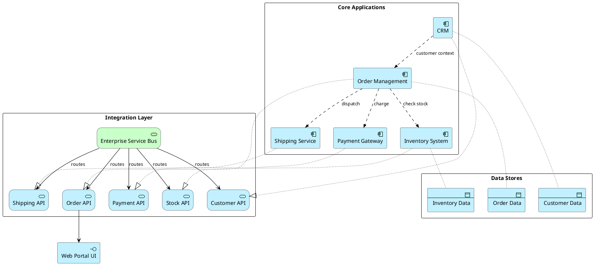

# Application Integration

Application-to-application integration view showing data flows, interfaces, and shared services.

## Key Elements

| Layer | Macros Used |
|-------|-------------|
| Application | `Application_Component`, `Application_Service`, `Application_Interface`, `Application_DataObject` |
| Technology | `Technology_Service` |

## Example

E-commerce platform integration: web portal, order management, inventory, payment, and shipping systems:

## Pattern Notes

1. **Application Interface** — `Application_Interface` for the user-facing entry point (Web Portal UI)
2. **Realization** — Each `Application_Component` realizes its corresponding `Application_Service` (API)
3. **ESB pattern** — `Technology_Service` represents the Enterprise Service Bus routing all API traffic
4. **Flow** — `Rel_Flow` shows data/message flows between applications (check stock, charge, dispatch)
5. **Access** — `Rel_Access` links components to their data stores
6. **Serving** — `Rel_Serving` shows APIs serving the UI and ESB serving all APIs
