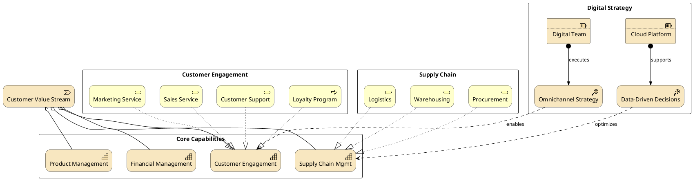

# Business Capability Model

Strategy and business capability mapping with value streams, resources, and courses of action.

## Key Elements

| Layer | Macros Used |
|-------|-------------|
| Strategy | `Strategy_Capability`, `Strategy_Resource`, `Strategy_CourseOfAction`, `Strategy_ValueStream` |
| Business | `Business_Service`, `Business_Process`, `Business_Actor` |

## Example

Retail company capability model: customer engagement, supply chain, and digital transformation strategy:

## Pattern Notes

1. **Value Stream** — `Strategy_ValueStream` as the top-level container representing end-to-end customer value delivery
2. **Capability decomposition** — `Rel_Aggregation` breaks the value stream into core capabilities
3. **Business realization** — `Rel_Realization` links business services/processes to the capabilities they realize
4. **Strategy influence** — `Rel_Influence` shows how courses of action (strategies) affect capabilities
5. **Resource assignment** — `Rel_Assignment` links resources (team, platform) to the strategies they support
6. **Layered grouping** — Separate rectangles for core capabilities, sub-capabilities, and digital strategy initiatives
