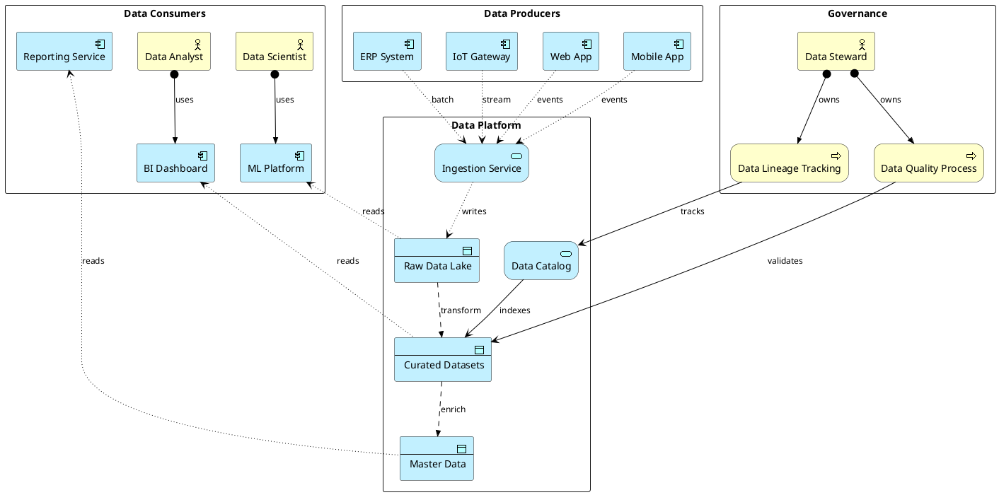

# Data Architecture

Data ownership, data flows, and access patterns across applications with data objects and access relationships.

## Key Elements

| Layer | Macros Used |
|-------|-------------|
| Business | `Business_Actor`, `Business_Process` |
| Application | `Application_Component`, `Application_DataObject`, `Application_Service` |

## Example

Customer data platform: data producers, data lake, and consuming analytics services with access controls:

## Pattern Notes

1. **Access directions** — `Rel_Access_w` for write access (producers → ingestion), `Rel_Access_r` for read access (consumers ← datasets)
2. **Data flow** — `Rel_Flow` shows data transformation pipeline: raw → curated → master data
3. **Data ownership** — `Business_Actor` (Data Steward) assigned to governance processes via `Rel_Assignment`
4. **Four zones** — Producers, Platform, Consumers, Governance form a clear data architecture layout
5. **Catalog serving** — `Rel_Serving` links the Data Catalog to curated datasets (metadata indexing)
6. **Mixed access patterns** — BI reads curated data, ML reads raw data, Reporting reads master data — showing different consumer needs
