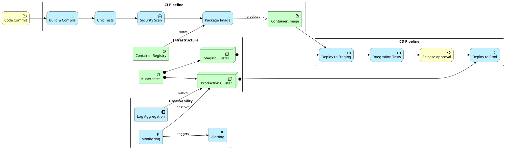

# DevOps Pipeline

CI/CD delivery pipeline modeled with ArchiMate: from code commit through build, test, deploy to production.

## Key Elements

| Layer | Macros Used |
|-------|-------------|
| Business | `Business_Process`, `Business_Event` |
| Application | `Application_Component`, `Application_Service`, `Application_Function` |
| Technology | `Technology_Node`, `Technology_SystemSoftware`, `Technology_Artifact` |

## Example

GitOps pipeline: commit → build → test → stage → prod with approval gate and monitoring:

## Pattern Notes

1. **Left-to-right flow** — `left to right direction` for natural pipeline reading: commit → build → test → deploy
2. **Triggering chain** — `Rel_Triggering` creates the sequential pipeline stages; each stage triggers the next
3. **Artifact** — `Technology_Artifact` for the container image produced by the package stage
4. **Business Process gate** — `Business_Process` for release approval (human decision point in the automated pipeline)
5. **Dual environments** — Staging and Production as separate `Technology_Node`, both assigned to Kubernetes
6. **Observability** — Monitoring, Logging, Alerting as `Application_Component` serving the production cluster
7. **Mixed layers** — Business events trigger application functions running on technology nodes — proper ArchiMate cross-layer modeling
