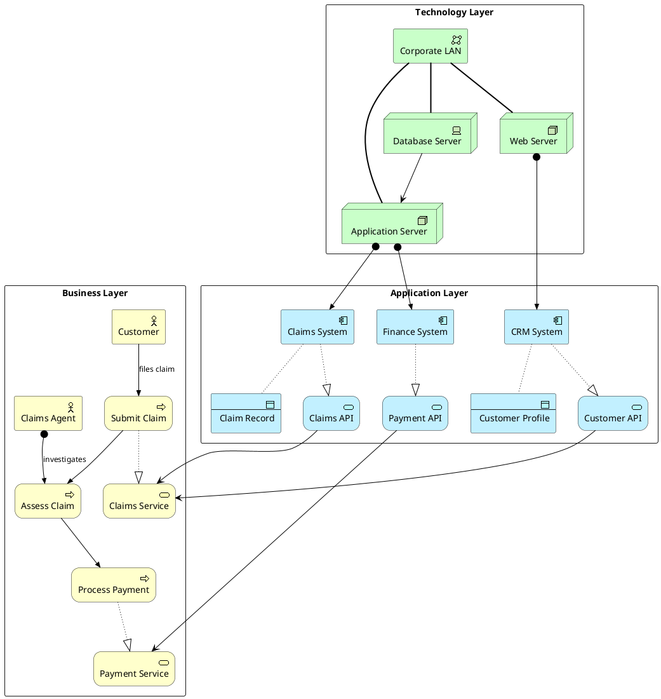

# Enterprise Landscape

Full three-layer ArchiMate view: Business → Application → Technology for an insurance company.

## Key Elements

| Layer | Macros Used |
|-------|-------------|
| Business | `Business_Actor`, `Business_Process`, `Business_Service` |
| Application | `Application_Component`, `Application_Service` |
| Technology | `Technology_Node`, `Technology_Device`, `Technology_CommunicationNetwork` |

## Example

Insurance claim handling across business processes, application services, and infrastructure:

## Pattern Notes

1. **Three-layer structure** — `rectangle "Business Layer"`, `"Application Layer"`, `"Technology Layer"` map to core ArchiMate layers
2. **Realization** — `Rel_Realization` links business processes to services, and application components to application services
3. **Serving** — `Rel_Serving` shows application services serving business services (upward dependency)
4. **Assignment** — `Rel_Assignment` assigns technology nodes to application components (hosting relationship)
5. **Triggering chain** — `Rel_Triggering` creates the sequential flow: Submit → Assess → Pay
6. **Data objects** — `Application_DataObject` with `Rel_Access` shows which components read/write which data
