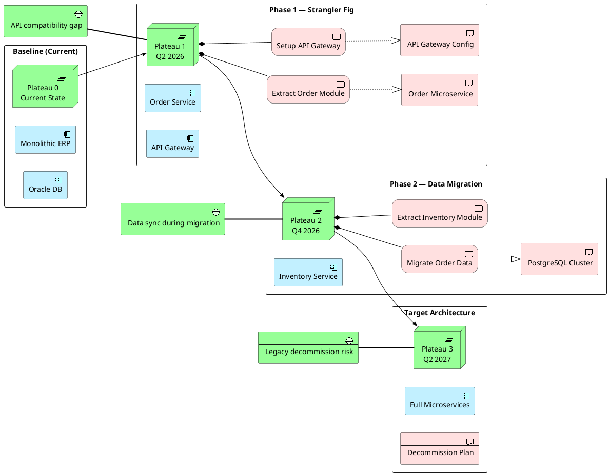

# Migration Planning

Plateau-based migration roadmap: baseline → intermediate → target architecture with work packages and gaps.

## Key Elements

| Layer | Macros Used |
|-------|-------------|
| Implementation | `Implementation_Plateau`, `Implementation_Gap`, `Implementation_WorkPackage`, `Implementation_Deliverable` |
| Application | `Application_Component` |

## Example

Legacy ERP migration: monolith → microservices over three plateaus with identified gaps:

## Pattern Notes

1. **Plateau sequence** — `Implementation_Plateau` represents architecture states at specific milestones; `Rel_Triggering` chains them in order
2. **Work Packages** — `Implementation_WorkPackage` are the actionable tasks within each plateau; `Rel_Composition` groups them under the plateau
3. **Deliverables** — `Implementation_Deliverable` are the outputs of work packages; `Rel_Realization` links work → deliverable
4. **Gaps** — `Implementation_Gap` identifies risks and incompatibilities between plateaus
5. **Left-to-right** — `left to right direction` reads the timeline naturally: Baseline → Phase 1 → Phase 2 → Target
6. **Mixed layers** — Application Components appear alongside Implementation elements to show what changes at each phase
