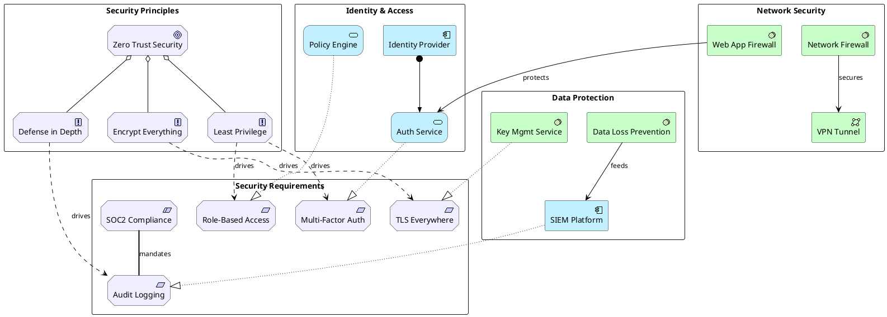

# Security Architecture

Security controls mapped across motivation (requirements), application (services), and technology (infrastructure).

## Key Elements

| Layer | Macros Used |
|-------|-------------|
| Motivation | `Motivation_Requirement`, `Motivation_Constraint`, `Motivation_Principle`, `Motivation_Goal` |
| Application | `Application_Component`, `Application_Service` |
| Technology | `Technology_Node`, `Technology_SystemSoftware`, `Technology_CommunicationNetwork` |

## Example

Zero-trust security model: security principles → requirements → controls across identity, network, and data layers:

## Pattern Notes

1. **Motivation → Implementation** — Goals decompose into Principles (`Rel_Aggregation`), Principles influence Requirements (`Rel_Influence`), Controls realize Requirements (`Rel_Realization`)
2. **Constraint** — `Motivation_Constraint` for external compliance mandates (SOC2) that link to requirements
3. **Three security domains** — Identity & Access, Network Security, Data Protection each in their own rectangle
4. **Cross-layer traceability** — From high-level goal (Zero Trust) down to specific technology controls (WAF, KMS, DLP), fully traceable through ArchiMate relationships
5. **Serving** — `Rel_Serving` shows technology components protecting/serving application services
