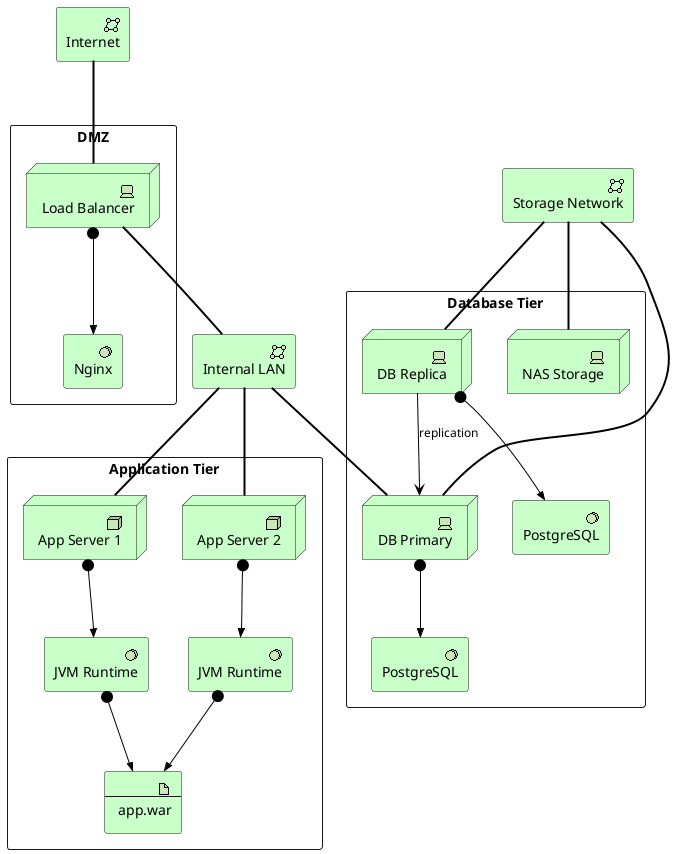

# Technology Infrastructure

Technology layer view: servers, networks, system software, and their hosting relationships.

## Key Elements

| Layer | Macros Used |
|-------|-------------|
| Technology | `Technology_Device`, `Technology_Node`, `Technology_SystemSoftware`, `Technology_Artifact`, `Technology_CommunicationNetwork`, `Technology_Service` |

## Example

Three-tier deployment: load balancer → app cluster → database cluster with shared storage network:

## Pattern Notes

1. **Device vs Node** — `Technology_Device` for physical hardware (load balancer, DB servers, NAS); `Technology_Node` for logical compute units (app servers)
2. **SystemSoftware** — `Technology_SystemSoftware` for runtime environments (Nginx, JVM, PostgreSQL) assigned to their host
3. **Artifact** — `Technology_Artifact` for deployable units (app.war) assigned to the runtime
4. **Communication Networks** — `Technology_CommunicationNetwork` for network segments (Internet, LAN, SAN); elements connect via `Rel_Association`
5. **Replication** — `Rel_Serving` between DB replica and primary shows data replication relationship
6. **Zone grouping** — `rectangle "DMZ"`, `"Application Tier"`, `"Database Tier"` represent network security zones
