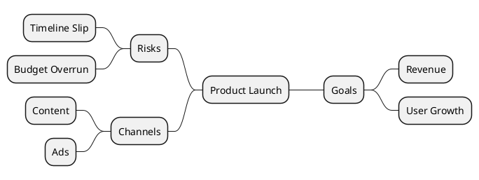

# Mind Map Diagram Generator

**Quick Start:** Start with `@startmindmap` -> define root and branches with `*` or `+/-` markers -> optionally set branch side, direction, and styles -> wrap in ` ```plantuml ` fence.

> ⚠️ **IMPORTANT:** Always use ` ```plantuml ` or ` ```puml ` code fence. NEVER use ` ```text ` — it will NOT render as a diagram.

## Critical Rules

- Every diagram starts with `@startmindmap` and ends with `@endmindmap`
- Each hierarchy level is represented by repeating markers:
  - `*` style: `*` (root), `**` (level 1), `***` (level 2)
  - `+/-` style: `+` grows left branch, `-` grows right branch
- Keep one marker style consistent in the same local branch (do not randomly mix indentation styles)
- Use `left side` to switch subsequent branches to the left side of the root
- Use direction keywords when needed:
  - `top to bottom direction`
  - `right to left direction`
- Multi-line node content must use block syntax:
  - `**:Line 1\nLine 2;`
- For quick color coding, use inline node color:
  - `*[#Orange] Root`
  - `**[#lightgreen] Child`
- For reusable themes, define `<style>` and apply stereotypes like `<<green>>`
- Rich text/Creole and icon syntax are supported inside node text (see examples)

## Node Syntax Cheat Sheet

| Pattern | Meaning | Example |
|--------|---------|---------|
| `* Root` | Root node with star syntax | `* Product Strategy` |
| `** Child` | First-level child | `** Goals` |
| `*** Grandchild` | Deeper hierarchy | `*** KPI` |
| `+ Root` | Root node with +/- syntax | `+ Architecture` |
| `++ Left branch` | Branch expanding on one side | `++ Services` |
| `-- Right branch` | Branch expanding on opposite side | `-- Risks` |
| `***_ Boxless` | Boxless/minimal child node | `***_ Notes` |
| `# Root` | Alternative root marker style | `# Topic` |
| `**:...;` | Multi-line block node | `**:Item A\nItem B;` |

## Branch Side and Direction

| Control | Syntax | Use Case |
|--------|--------|---------|
| Left-side split | `left side` | Split map into left/right groups from root |
| Top-to-bottom | `top to bottom direction` | Tree-like vertical hierarchy |
| Right-to-left | `right to left direction` | RTL reading flow or mirrored layouts |

## Styling Options

| Method | Syntax | Best For |
|-------|--------|----------|
| Inline node color | `**[#FFBBCC] Idea` | Fast per-node emphasis |
| Reusable class style | `<style> ... .green { ... } </style>` + `<<green>>` | Consistent visual themes |
| Depth-based style | `:depth(1) { ... }` | Global formatting by hierarchy depth |
| Node/arrow global style | `node { ... }` / `arrow { ... }` | Unified typography and connectors |

## Recommended Color Palettes

Pick a palette that matches the map's purpose. Use inline `[#hex]` for quick coloring or define `<style>` classes for reuse.

### General-Purpose (Pastel)

| Role | Hex | Preview | Usage |
|------|-----|---------|-------|
| Root | `#2196F3` | 🔵 | Central topic |
| Branch A | `#A5D6A7` | 🟢 | Category / group 1 |
| Branch B | `#90CAF9` | 🔵 | Category / group 2 |
| Branch C | `#CE93D8` | 🟣 | Category / group 3 |
| Branch D | `#FFE082` | 🟡 | Category / group 4 |
| Leaf | `#E0E0E0` | ⚪ | Detail nodes |

### Status / RAG

| Status | Hex | Usage |
|--------|-----|-------|
| Done / OK | `#C8E6C9` | Completed, healthy |
| In Progress | `#FFF9C4` | Active, warning |
| Blocked / Risk | `#FFCDD2` | Issue, danger |
| Not Started | `#E0E0E0` | Pending, neutral |

### Warm Corporate

| Role | Hex |
|------|-----|
| Root | `#1565C0` |
| Level 1 | `#FFB74D` |
| Level 2 | `#4DB6AC` |
| Level 3 | `#E0E0E0` |

### Cool Tech

| Role | Hex |
|------|-----|
| Root | `#263238` |
| Level 1 | `#00BCD4` |
| Level 2 | `#80DEEA` |
| Level 3 | `#B2EBF2` |

### Earth Tone

| Role | Hex |
|------|-----|
| Root | `#5D4037` |
| Level 1 | `#A1887F` |
| Level 2 | `#C8E6C9` |
| Level 3 | `#FFF9C4` |

> **Tip:** Avoid pure saturated colors (`#FF0000`, `#00FF00`) — they reduce readability. Prefer soft/muted tones for backgrounds and reserve bold colors for the root only.

## Mind Map Patterns

| Pattern | Purpose | Example |
|--------|---------|---------|
| Basic Hierarchy | Topic decomposition and study outlines | [basic-hierarchy.md](examples/basic-hierarchy.md) |
| Bilateral Layout | Pros/cons, options vs risks, two-side analysis | [bilateral-layout.md](examples/bilateral-layout.md) |
| Boxless Branches | Lightweight secondary nodes and annotations | [boxless-branches.md](examples/boxless-branches.md) |
| Styled Theme | Color-coded branches and reusable classes | [styled-theme.md](examples/styled-theme.md) |
| Direction Control | Vertical or RTL reading direction | [direction-control.md](examples/direction-control.md) |
| Rich Text Content | Detailed notes with icons and formatting | [rich-text-content.md](examples/rich-text-content.md) |
| Project Planning | Work breakdown and action map | [project-planning.md](examples/project-planning.md) |

## Quick Example



## Common Pitfalls

| Issue | Solution |
|------|----------|
| Diagram not rendered | Use ` ```plantuml ` fence + `@startmindmap ... @endmindmap` |
| Branch depth looks wrong | Check marker count (`*`, `**`, `***`) and indentation consistency |
| Multi-line text breaks parser | Use `: ... ;` block syntax, ensure trailing `;` exists |
| Colors not applied | Verify hex format (`#RRGGBB`) or stereotype class names |
| Layout direction unexpected | Add explicit `top to bottom direction` or `right to left direction` |
