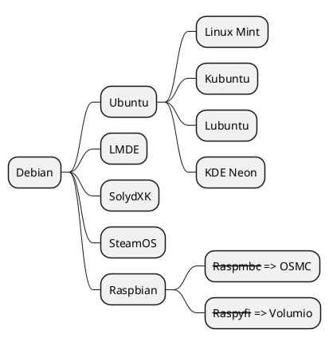

# Basic Hierarchy Mind Map

Linux distribution hierarchy with simple branching.

## Example

## Pattern Notes

1. Root starts with `*`, each deeper level adds one more `*`.
2. This is the fastest style for tree-like decomposition.
3. Inline text formatting like `<s>...</s>` works in nodes.
