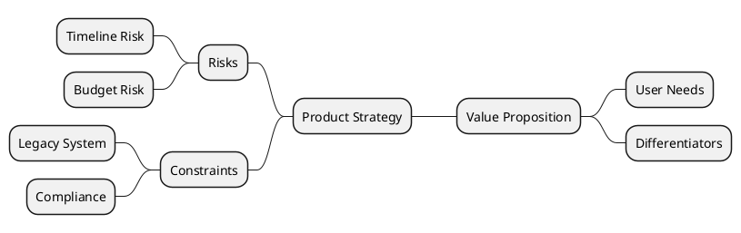

# Bilateral Branch Layout

Split content to left and right sides for comparison.

## Example

## Pattern Notes

1. `+` and `-` markers help express two-sided structures.
2. `left side` moves subsequent branches to the left of the root.
3. Great for pros/cons, opportunities/risks, or options/trade-offs.
