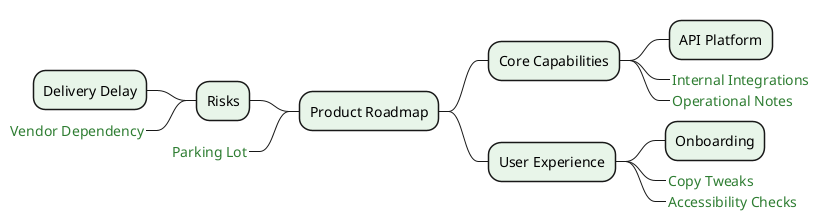

# Boxless Branches Mind Map

Use boxless node variants to reduce visual weight for secondary branches.

## Example

## Pattern Notes

1. Add `_` after branch marker (for example `+++_`) to render a boxless node.
2. Boxless nodes are useful for optional details and annotations.
3. `boxless { ... }` in `<style>` lets you globally tune typography for boxless nodes.
4. You can mix boxed and boxless nodes in the same branch hierarchy.
