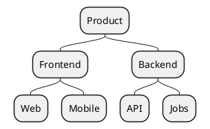
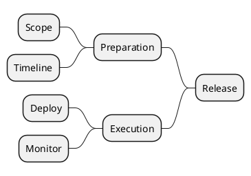

# Direction Control Mind Map

Force vertical or RTL layout for specific reading flows.

## Example 1: Top to Bottom

## Example 2: Right to Left

## Pattern Notes

1. Use `top to bottom direction` for org/tree-style diagrams.
2. Use `right to left direction` for mirrored layouts or RTL context.
3. Explicit direction improves rendering consistency for long maps.
