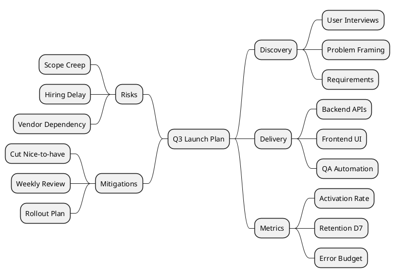

# Project Planning Mind Map

A practical work-breakdown mind map for project execution.

## Example

## Pattern Notes

1. Keep planning maps action-oriented and measurable.
2. Put risks/mitigations on one side for quick executive review.
3. Combine this with style classes when presenting to stakeholders.
