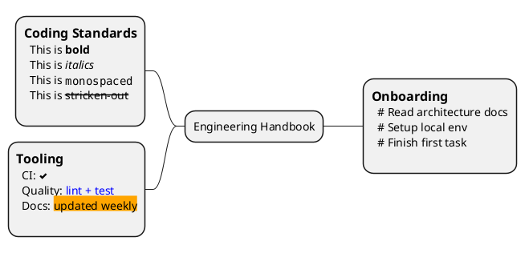

# Rich Text Content Mind Map

Embed detailed notes using block nodes and Creole formatting.

## Example

## Pattern Notes

1. Use `: ... ;` for multi-line node blocks.
2. Creole formatting is useful for dense documentation maps.
3. Icons and inline colors help emphasize key notes.
