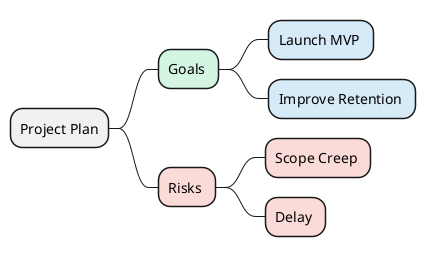

# Styled Mind Map Theme

Use style blocks and stereotypes for reusable visual classes.

## Example

## Pattern Notes

1. Define reusable classes in `<style>` once, then apply via `<<class>>`.
2. Keeps large maps visually consistent.
3. Prefer semantic class names (`goal`, `risk`, `action`) over color names.
