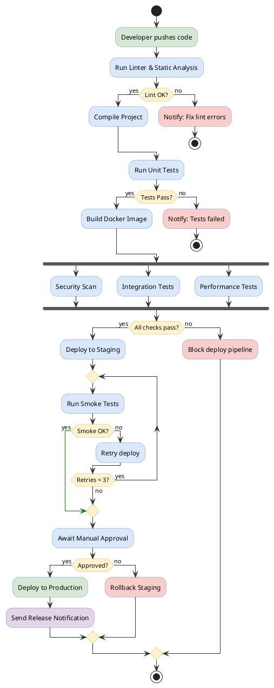

# Activity Diagram

Shows workflow with activities, decisions, loops, and parallel processing.

## Key Elements

- **Start**: `start` — solid black circle
- **Stop**: `stop` — bullseye circle
- **End**: `end` — circle with X (terminates flow only)
- **Activity**: `:action;` — rounded rectangle
- **Decision**: `if (condition) then (yes) ... else (no) ... endif`
- **Switch**: `switch (var) ... case (val) ... endswitch`
- **Fork/Join**: `fork ... fork again ... end fork`
- **While loop**: `while (condition) ... endwhile`
- **Repeat loop**: `repeat ... repeat while (condition)`

## Edge Styles

| Type | Syntax | Description |
|---|---|---|
| Control flow | `->` (implicit) | Default solid arrow |
| Labeled flow | `->[label]` | Arrow with guard label |
| Colored arrow | `-[#color]->` | Arrow with custom color |
| Detach | `detach` | Terminate a branch |
| Kill | `kill` | Force stop a branch |

## Recommended Colors

| Element | Color | Usage |
|---|---|---|
| Start activity | `#d5e8d4` (light green) | Input/receive actions |
| Process activity | `#dae8fc` (light blue) | Processing steps |
| Decision | `#fff2cc` (light yellow) | Branch points |
| Error/Cancel | `#f8cecc` (light red) | Error handling |
| Output | `#e1d5e7` (light purple) | Results/output |

## Example 1

CI/CD pipeline with decisions, loops, and parallel stages:

