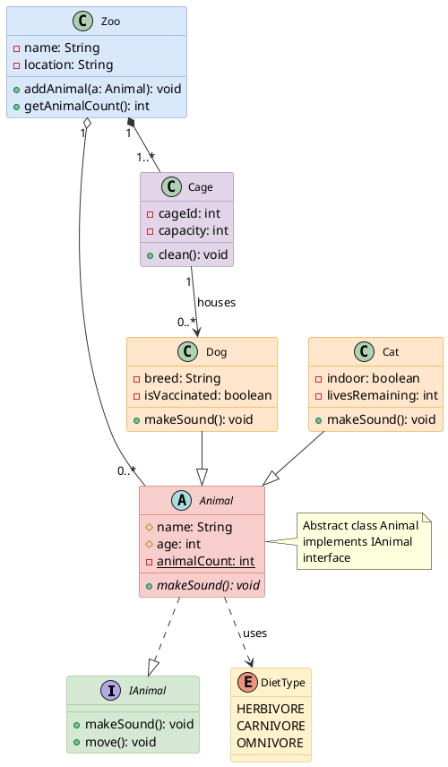
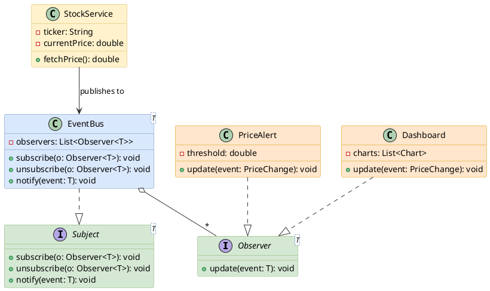

# Class Diagram

Shows class structure with attributes, methods, and relationships between classes.

## Key Elements

- **Class**: `class ClassName { }` — define attributes and methods inside braces
- **Abstract class**: `abstract class Name` — italic name
- **Interface**: `interface Name` — with `<<interface>>` stereotype
- **Enumeration**: `enum Name` — list values inside braces
- **Visibility**: `+` public, `#` protected, `-` private, `~` package
- **Static member**: `{static}` modifier
- **Abstract method**: `{abstract}` modifier

## Relationships

| Relationship | Syntax | Description |
|---|---|---|
| Inheritance | `<\|--` | Hollow triangle (extends) |
| Realization | `..\|>` | Dashed + hollow triangle (implements) |
| Association | `-->` | Open arrow |
| Aggregation | `o--` | Hollow diamond (has-a) |
| Composition | `*--` | Filled diamond (owns) |
| Dependency | `..>` | Dashed open arrow (uses) |

## Recommended Colors

| Element | Color | Usage |
|---|---|---|
| Interface | `#d5e8d4` (light green) | Contract definitions |
| Abstract class | `#f8cecc` (light red) | Base classes |
| Concrete class | `#dae8fc` (light blue) | Regular classes |
| Enum | `#fff2cc` (light yellow) | Enumerations |
| Subclass | `#ffe6cc` (light orange) | Derived classes |
| Utility | `#e1d5e7` (light purple) | Utility/helper classes |

## Example 1

Zoo management system with interfaces, abstract class, enums, and various relationships:

## Example 2

Observer pattern with generic types and dependency relationships:

