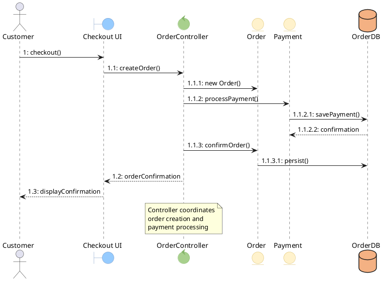

# Communication Diagram

Shows interactions between objects, emphasizing structural organization and numbered message sequences.

## Key Elements

| Element | Syntax | Description |
|---|---|---|
| Object | `participant "name" as alias` or `object "name" as alias` | Object instance |
| Actor | `actor "name" as alias` | External participant |
| Boundary | `boundary "name" as alias` | UI/interface object |
| Control | `control "name" as alias` | Controller object |
| Entity | `entity "name" as alias` | Data/database object |
| Link | `A -> B` | Association between objects |
| Numbered message | `A -> B : 1: message` | Sequential message |

## Message Numbering

- **Sequential**: `1, 2, 3...` — messages in order
- **Nested**: `1.1, 1.2, 1.1.1...` — sub-messages within a call
- **Concurrent**: `1a, 1b` — parallel messages at same level

## Recommended Colors

| Element | Color | Usage |
|---|---|---|
| Boundary | `#96CBFE` (sky blue) | UI/interface objects |
| Control | `#A8D08D` (sage green) | Controller objects |
| Entity | `#fff2cc` (light yellow) | Data objects |
| Actor | default | External participants |
| Database | `#F4B183` (peach) | Data storage |

## Example 1

E-commerce checkout process with numbered message sequences:

