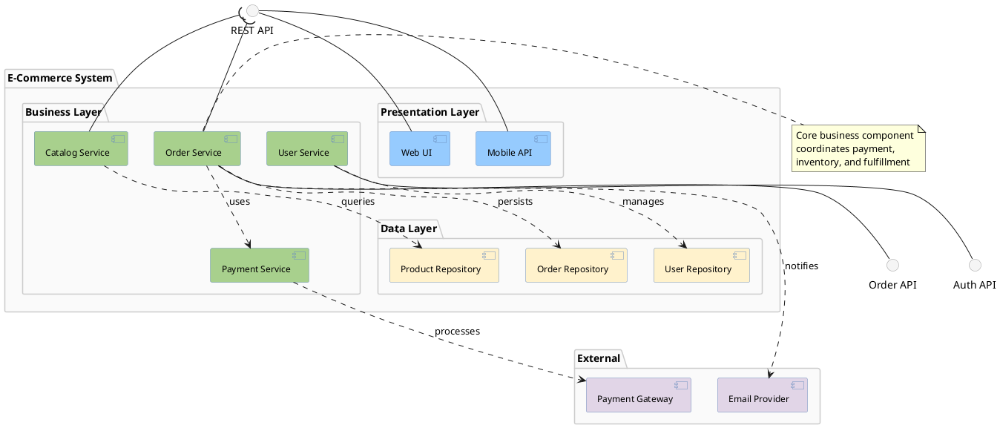

# Component Diagram

Shows system component organization, interfaces, and dependencies.

## Key Elements

| Element | Syntax | Description |
|---|---|---|
| Component | `component "Name" as alias` or `[Name]` | Rectangle with component icon |
| Interface | `interface "Name" as alias` or `() "Name"` | Lollipop circle |
| Port | `port "Name" as alias` | Interaction point |
| Package | `package "Name" { }` | Container |
| Provided | `comp -- intf` | Component provides interface |
| Required | `comp ..> intf` | Component requires interface |
| Dependency | `[A] ..> [B]` | Dashed arrow |

## Interface Notations

```
  ()── Provided interface (lollipop) - "I provide this"
  ──)  Required interface (socket) - "I need this"
```

## Recommended Colors

| Element | Color | Usage |
|---|---|---|
| Core component | `#dae8fc` (light blue) | Main business logic |
| Service component | `#d5e8d4` (light green) | Service layer |
| Data component | `#fff2cc` (light yellow) | Data access/storage |
| External component | `#e1d5e7` (light purple) | External/third-party |
| Interface | `#f5f5f5` (light gray) | Provided/required interfaces |
| Package | `#FAFAFA` (near white) | Subsystem boundaries |

## Example 1

E-commerce system with components, interfaces, and internal structure:


