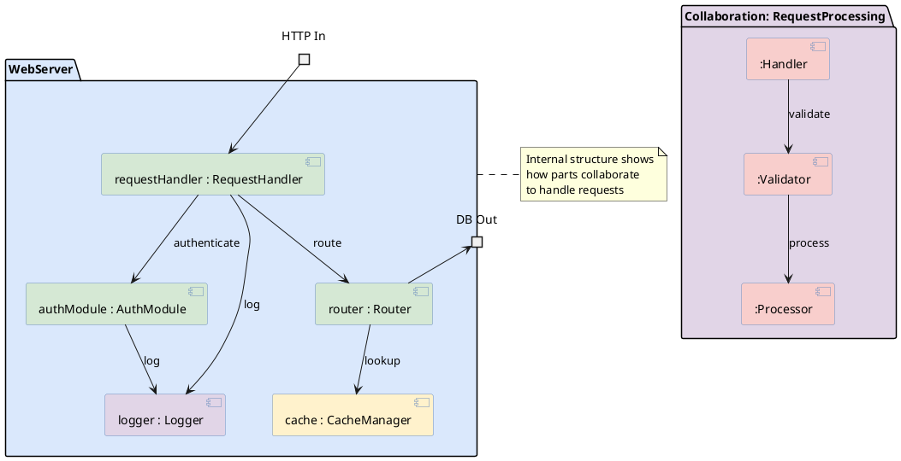

# Composite Structure Diagram

Shows the internal structure of a classifier and collaborations between parts.

## Key Elements

| Element | Syntax | Description |
|---|---|---|
| Class with parts | `component "Name" { }` | Container showing internal structure |
| Part | `component "name : Type"` | Named part inside a classifier |
| Port | `portin` / `portout` | Interaction point on boundary |
| Connector | `part1 --> part2` | Link between internal parts |
| Collaboration | Use note/package for collaboration | Dashed ellipse (approximate) |
| Role | Elements inside collaboration | Participants in collaboration |

## Recommended Colors

| Element | Color | Usage |
|---|---|---|
| Classifier | `#dae8fc` (light blue) | Main class container |
| Part | `#d5e8d4` (light green) | Internal parts |
| Port | `#fff2cc` (light yellow) | Interaction points |
| Connector | `#333333` (dark gray) | Internal connections |
| Collaboration | `#e1d5e7` (light purple) | Collaboration containers |

## Example 1

Server component showing internal structure with ports and parts:

