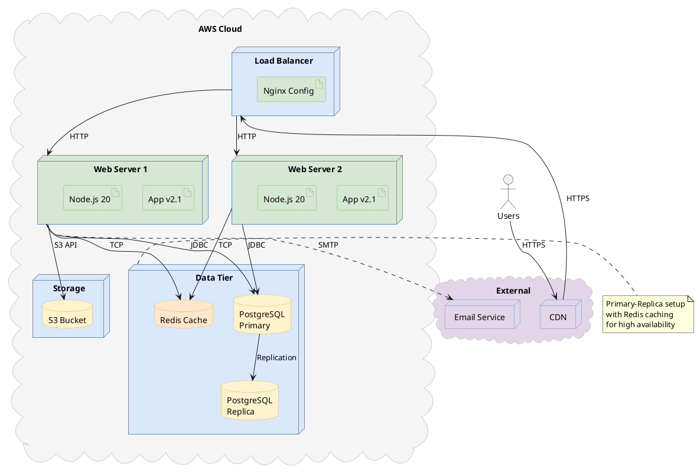

# Deployment Diagram

Shows physical deployment architecture of the system.

## Key Elements

| Element | Syntax | Description |
|---|---|---|
| Node | `node "Name" { }` | 3D box for execution environment |
| Device | `node "Name" <<device>>` | Physical hardware |
| Artifact | `artifact "Name"` | Deployable unit |
| Database | `database "Name"` | Data storage |
| Component | `component "Name"` | Software component |
| Cloud | `cloud "Name" { }` | Cloud infrastructure |
| Communication | `node1 -- node2 : protocol` | Network connection |
| Deploy | `artifact ..> node : <<deploy>>` | Deployment relationship |

## Recommended Colors

| Element | Color | Usage |
|---|---|---|
| Load balancer | `#dae8fc` (light blue) | Entry point / routing |
| Web server | `#d5e8d4` (light green) | Application servers |
| Database | `#fff2cc` (light yellow) | Data storage |
| Cache | `#ffe6cc` (light orange) | Caching layer |
| External service | `#e1d5e7` (light purple) | Third-party |
| Cloud container | `#F5F5F5` (light gray) | Cloud boundary |

## Example 1

Application server deployment with load balancer, web servers, and database cluster:

