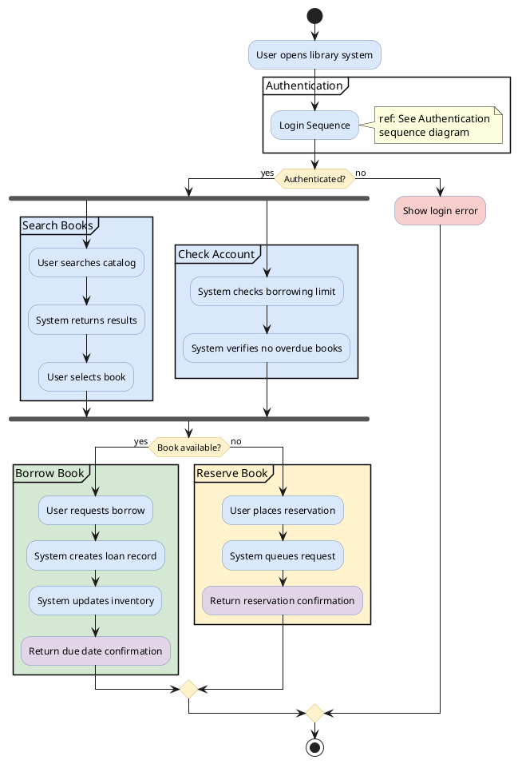

# Interaction Overview Diagram

Combines activity diagram control flow with sequence diagram interaction fragments.

## Key Elements

| Element | Syntax | Description |
|---|---|---|
| Start node | `start` | Initial node (filled circle) |
| End node | `stop` | Final node |
| Decision | `if/else/endif` | Branch point (diamond) |
| Fork/Join | `fork/fork again/end fork` | Parallel execution |
| Group | `group Label ... end group` | Frame container for grouping steps |
| Partition | `partition #color "Label" { }` | Colored partition container |
| Guard condition | `if (condition)` | Condition on branch |

## Recommended Colors

| Element | Color | Usage |
|---|---|---|
| Interaction frame | `#dae8fc` (light blue) | Sequence fragments |
| Reference frame | `#d5e8d4` (light green) | Referenced interactions |
| Decision | `#fff2cc` (light yellow) | Branch points |
| Error path | `#f8cecc` (light red) | Error handling flows |
| Final result | `#e1d5e7` (light purple) | Output/result |

## Example 1

Library system interaction overview with mixed activity and sequence flows:

