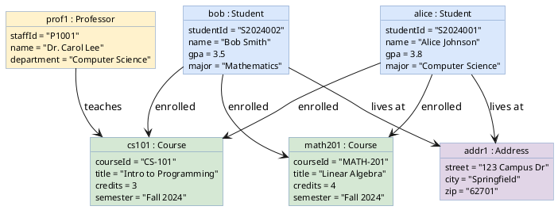
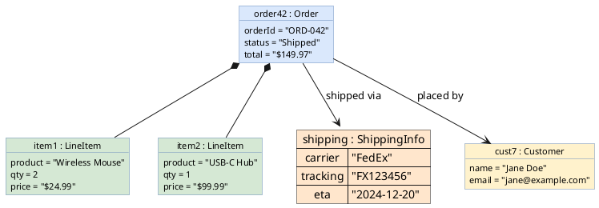

# Object Diagram

Shows instances (objects) and their attribute values at a specific point in time.

## Key Elements

| Element | Syntax | Description |
|---|---|---|
| Object | `object "name : Class" as alias` | Instance with class type |
| Attribute | `alias : attrName = "value"` | Attribute value assignment |
| Link | `obj1 --> obj2` | Association between instances |
| Link label | `obj1 --> obj2 : label` | Named association |
| Map | `map "Name" as alias { key => value }` | Key-value container |

## Recommended Colors

| Element | Color | Usage |
|---|---|---|
| Entity object | `#dae8fc` (light blue) | Domain objects |
| Value object | `#d5e8d4` (light green) | Value types |
| Reference object | `#fff2cc` (light yellow) | Referenced entities |
| Collection | `#ffe6cc` (light orange) | Lists/sets |
| Config object | `#e1d5e7` (light purple) | Configuration |

## Example 1

University system snapshot showing students, courses, and their relationships:

## Example 2

E-commerce order snapshot with map and linked objects:

