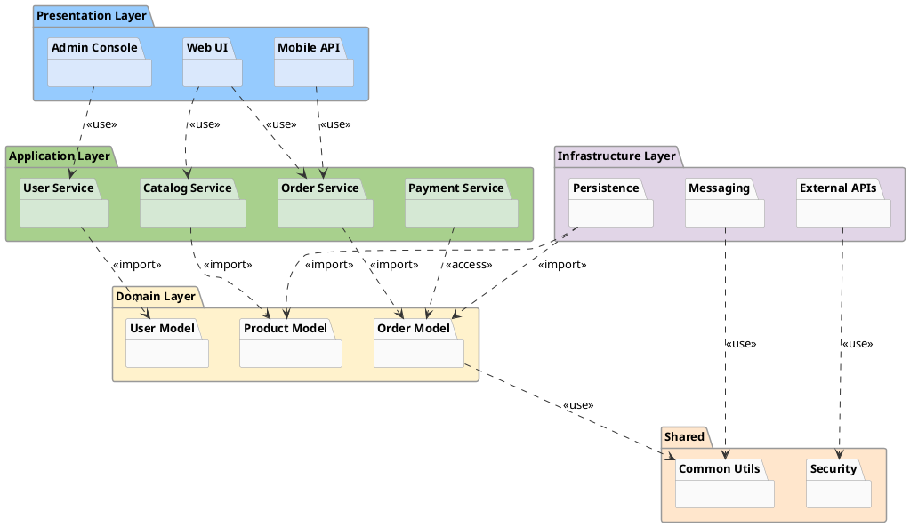
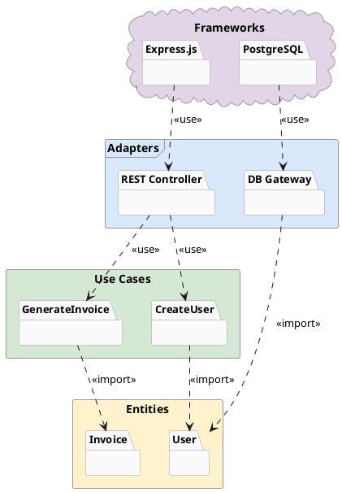

# Package Diagram

Shows the modular organization structure of a system.

## Key Elements

- **Package**: `package "Name" { }` — folder shape container
- **Nested package**: Package inside package
- **Dependency**: `pkg1 ..> pkg2` — dashed arrow
- **Import**: `pkg1 ..> pkg2 : <<import>>` — package imports another
- **Access**: `pkg1 ..> pkg2 : <<access>>` — restricted access
- **Merge**: `pkg1 ..> pkg2 : <<merge>>` — package merge
- **Use**: `pkg1 ..> pkg2 : <<use>>` — usage dependency
- **Stereotype**: `package "Name" <<Node>>` — package with stereotype shape

## Package Stereotypes (Shapes)

| Stereotype | Syntax | Shape |
|---|---|---|
| Folder | `package "Name"` | Default folder tab |
| Rectangle | `package "Name" <<Rectangle>>` | Plain rectangle |
| Frame | `package "Name" <<Frame>>` | Frame with label |
| Cloud | `package "Name" <<Cloud>>` | Cloud shape |
| Database | `package "Name" <<Database>>` | Cylinder |
| Node | `package "Name" <<Node>>` | 3D box |

## Recommended Colors

| Layer | Color | Usage |
|---|---|---|
| Presentation | `#96CBFE` (sky blue) | UI layer |
| Application | `#A8D08D` (sage green) | Service/business layer |
| Domain | `#fff2cc` (light yellow) | Domain model |
| Infrastructure | `#e1d5e7` (light purple) | Data/external access |
| Shared/Common | `#ffe6cc` (light orange) | Cross-cutting concerns |

## Example 1

E-commerce system module structure with layered architecture:

## Example 2

Clean Architecture with stereotype shapes:

