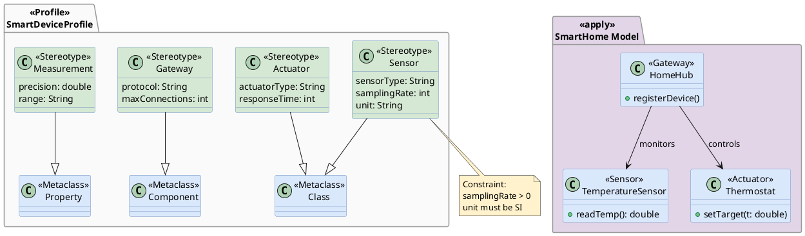

# Profile Diagram

Shows UML extension mechanisms, defining custom stereotypes to extend UML metaclasses.

## Key Elements

| Element | Syntax | Description |
|---|---|---|
| Profile | `package "Name" <<Profile>> { }` | Profile container |
| Metaclass | `class "Name" <<Metaclass>>` | Base UML metaclass |
| Stereotype | `class "Name" <<Stereotype>>` | Custom stereotype definition |
| Extension | `Stereotype --|> Metaclass` | Stereotype extends metaclass |
| Tagged value | Attributes inside stereotype class | Additional properties |
| Constraint | `note` attached to stereotype | OCL or natural language rules |

## Recommended Colors

| Element | Color | Usage |
|---|---|---|
| Metaclass | `#dae8fc` (light blue) | Standard UML metaclasses |
| Stereotype | `#d5e8d4` (light green) | Custom stereotype definitions |
| Profile | `#FAFAFA` (near white) | Profile container |
| Constraint | `#fff2cc` (light yellow) | Rules and constraints |
| Applied profile | `#e1d5e7` (light purple) | Profile application |

## Example 1

Smart device profile with stereotypes extending UML metaclasses:

