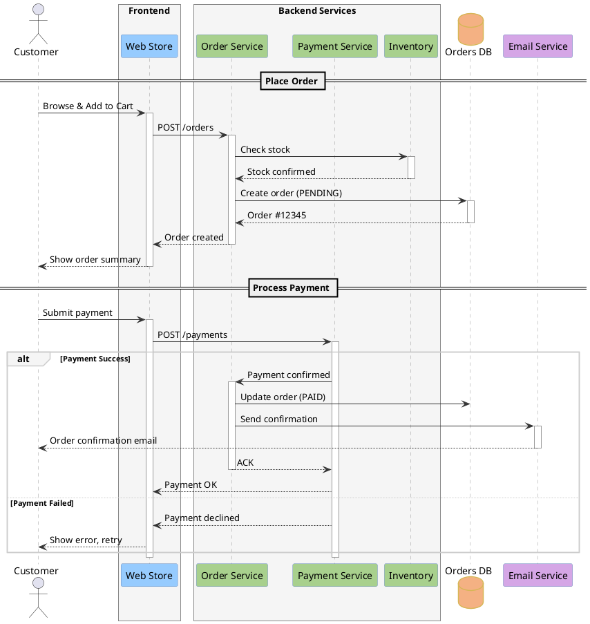
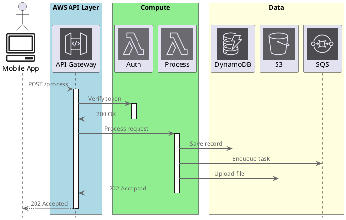

# Sequence Diagram

Shows message interactions between objects in chronological order.

## Key Elements

- **Participant**: `participant "Name" as alias` — rectangle lifeline
- **Actor**: `actor "Name" as alias` — stick figure lifeline
- **Entity**: `entity "Name" as alias` — circle with underline
- **Database**: `database "Name" as alias` — cylinder lifeline
- **Activation**: `activate` / `deactivate` or `++` / `--` shorthand
- **Destroy**: `destroy participant` — X mark on lifeline
- **Frame**: `box "Label" #color ... end box` — group participants

## Message Types

| Message | Syntax | Description |
|---|---|---|
| Synchronous | `->` | Solid line, filled arrow |
| Asynchronous | `->>` | Solid line, open arrow |
| Return | `-->` | Dashed line |
| Create | `create participant` + `->` | Creates new object |
| Self-call | `A -> A` | Message to self |

## Combined Fragments

| Fragment | Syntax | Description |
|---|---|---|
| alt/else | `alt ... else ... end` | Alternative (if-else) |
| opt | `opt ... end` | Optional (if) |
| loop | `loop ... end` | Loop iteration |
| par | `par ... else ... end` | Parallel execution |
| break | `break ... end` | Break out |

## Recommended Colors

| Element | Color | Usage |
|---|---|---|
| Actor | default | User/external entity |
| Frontend | `#96CBFE` (sky blue) | UI components |
| Backend | `#A8D08D` (sage green) | Server/service |
| Database | `#F4B183` (peach) | Data storage |
| External | `#D5A6E6` (lavender) | Third-party services |
| Box group | `#F5F5F5` (light gray) | Participant grouping |

## Example 1

E-commerce order processing with multiple participants and fragments:

## Example 2

AWS serverless API flow using stdlib icons (`<$SpriteName>` in participant labels):

