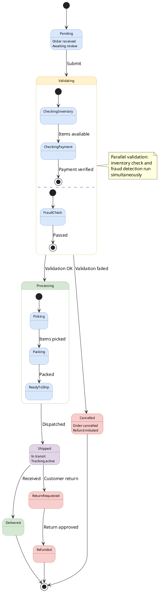

# State Machine Diagram

Shows state changes of an object during its lifecycle.

## Key Elements

- **State**: `state "Name" as alias` — rounded rectangle
- **Initial state**: `[*] -->` — solid black circle
- **Final state**: `--> [*]` — circle with outer ring
- **Transition**: `State1 --> State2 : event` — labeled arrow
- **Composite state**: `state Name { ... }` — container with substates
- **Choice**: `state name <<choice>>` — diamond decision point
- **Fork/Join**: `state name <<fork>>` / `<<join>>` — bar for parallel
- **History**: `state name <<history>>` / `<<deepHistory>>`
- **Entry/Exit point**: `<<entryPoint>>` / `<<exitPoint>>`
- **Internal transition**: `State : entry / action` — inside state

## Recommended Colors

| State Type | Color | Usage |
|---|---|---|
| Pending/Idle | `#dae8fc` (light blue) | Waiting states |
| Active/Processing | `#fff2cc` (light yellow) | In-progress states |
| Success/Complete | `#d5e8d4` (light green) | Successful outcomes |
| Error/Cancel | `#f8cecc` (light red) | Error/failure states |
| Final/Archive | `#e1d5e7` (light purple) | Terminal states |
| Inline style | `#color;line:color;text:color` | Per-element colors |

## Example 1

Order processing state machine with composite states and parallel regions:

