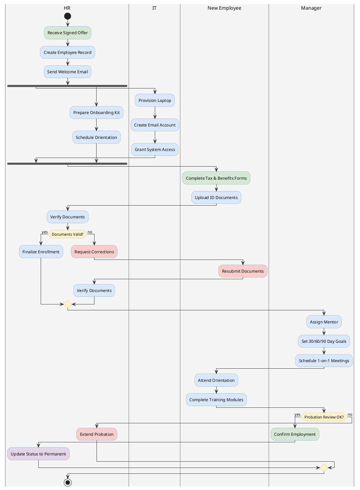

# Swimlane Activity Diagram

Shows workflow partitioned by roles or services using vertical swimlanes.

## Key Elements

- **Swimlane**: `|Lane Name|` — vertical partition by role/service
- **Colored lane**: `|#color|Lane Name|` — lane with background color
- **All activity elements** from Activity Diagram apply inside lanes
- Activities after a `|Lane|` marker belong to that lane until the next marker

## Swimlane Syntax

| Syntax | Description |
|---|---|
| `\|Lane\|` | Define or switch to a lane |
| `\|#f5f5f5\|Lane\|` | Lane with background color |
| Multiple `\|Lane\|` markers | Activities flow across lanes |

## Recommended Colors

| Element | Color | Usage |
|---|---|---|
| Swimlane background | `#f5f5f5` (light gray) | Default lane fill |
| Start activity | `#d5e8d4` (light green) | Input/receive actions |
| Process activity | `#dae8fc` (light blue) | Processing steps |
| Decision | `#fff2cc` (light yellow) | Branch points |
| Error/Cancel | `#f8cecc` (light red) | Error handling |
| Output | `#e1d5e7` (light purple) | Results/output |

## Example 1

Employee onboarding across HR, IT, Manager, and New Employee lanes:

