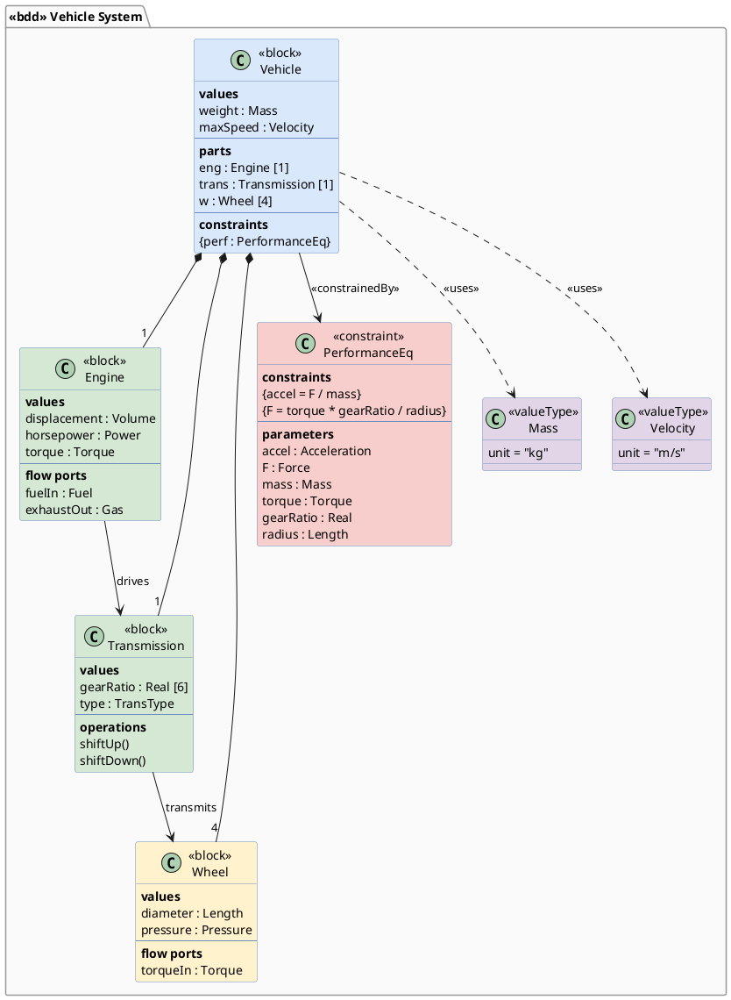

# SysML Block Definition Diagram (BDD)

Systems Modeling Language (SysML) extends UML for complex system design. Block Definition Diagrams show system structure with blocks, value types, and relationships.

## Key Elements

| Element | Syntax | Description |
|---|---|---|
| Block | `class "Name" <<block>>` | System building block |
| Constraint Block | `class "Name" <<constraint>>` | Mathematical constraint |
| Value Type | `class "Name" <<valueType>>` | Typed value |
| Flow Port | Attribute with `<<flowPort>>` | Data/material flow point |
| Composition | `*--` | Part-whole relationship |
| Reference | `o--` | Reference association |
| Compartments | Attributes grouped by region | values, parts, constraints |

## Block Compartments

| Compartment | Content |
|---|---|
| values | Value properties (typed attributes) |
| parts | Contained blocks (composition) |
| references | Referenced blocks |
| constraints | Constraint properties |
| operations | Block operations |
| flow ports | Flow interaction points |

## Recommended Colors

| Element | Color | Usage |
|---|---|---|
| System block | `#dae8fc` (light blue) | Top-level system |
| Subsystem block | `#d5e8d4` (light green) | Subsystem components |
| Hardware block | `#fff2cc` (light yellow) | Physical/hardware parts |
| Constraint block | `#f8cecc` (light red) | Mathematical constraints |
| Value type | `#e1d5e7` (light purple) | Value types |
| Package | `#FAFAFA` (near white) | Model package container |

## Example 1

Vehicle system BDD showing blocks with compartments and constraint blocks:

