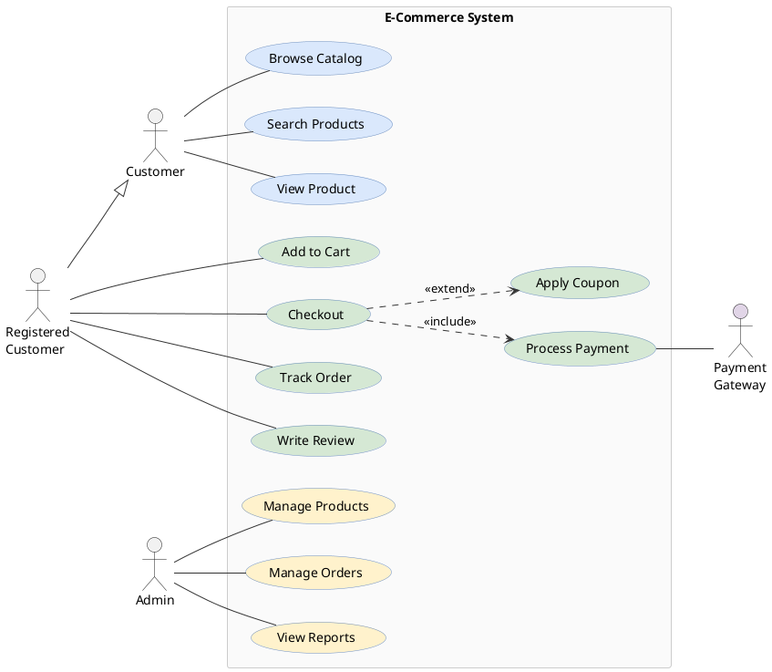

# Use Case Diagram

Describes system functional requirements and user interactions.

## Key Elements

- **Actor**: `actor "Name" as alias` — stick figure
- **Use Case**: `usecase "Name" as alias` or `(Name)` — ellipse
- **System boundary**: `rectangle "Name" { }` — container rectangle
- **Association**: `actor -- usecase` — solid line
- **Include**: `usecase1 ..> usecase2 : <<include>>` — dashed arrow
- **Extend**: `usecase1 ..> usecase2 : <<extend>>` — dashed arrow (arrow to base)
- **Generalization**: `actor1 --|> actor2` — hollow triangle arrow
- **Direction**: `left to right direction` — horizontal layout

## Recommended Colors

| Element | Color | Usage |
|---|---|---|
| Primary actor | default | Main users |
| System actor | `#e1d5e7` (light purple) | External systems |
| Core use case | `#dae8fc` (light blue) | Primary functions |
| Secondary use case | `#d5e8d4` (light green) | Supporting functions |
| Admin use case | `#fff2cc` (light yellow) | Management functions |
| System boundary | `#FAFAFA` (near white) | System container |

## Example 1

E-commerce system use cases with multiple actor types and relationships:

